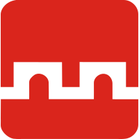
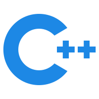
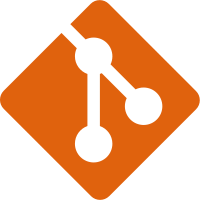
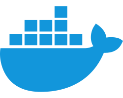

## Hello, I'm General_K1ng! 👋 

> This nickname originated from my elementary school days and has stuck with me ever since. 
>
> Cuz my family name is Jin in Chinese, it sounds like King.
>
> You can just call me **General_K1ng**.

### About Me 

- 💻 **Love for Computers**: Currently, a beginner in the vast world of computing. 

- 🎓 **Studying at**: **XJTLU**, majoring in the challenging field of Information and Computing Science. Any fellow students here? 

- 📍 **Location**: 
  - Based in Suzhou, Jiangsu ; 
  - often found in Xi'an, Shaanxi ; 
  - hometown is Wenzhou, Zhejiang . 

- 🧩 **Hobbies**: Consider myself a casual anime fan?

- 🚀 **Current Projects**: Working on some ~~amateur~~ open-source projects and continuously learning. 

- 💔 **Current Status**: Single.

**Language Options** : 🇨🇳 [Chinese](#) / 🇬🇧 [English](#)

**Mail me** : General_K1ng@outlook.com

### I Enjoy

<picture>
  <source media="(prefers-color-scheme: dark)" srcset="https://raw.githubusercontent.com/GeneralK1ng/GeneralK1ng/output/github-contribution-grid-snake-dark.svg">
  <source media="(prefers-color-scheme: light)" srcset="https://raw.githubusercontent.com/GeneralK1ng/GeneralK1ng/output/github-contribution-grid-snake.svg">
  
</picture>

- 🍲 Eating 
- 💤 Sleeping
- 💻 Coding  
- 📺 Watching anime
- 🎮 Steam

Feel free to visit my little corner of the blog <a href="https://generalk1ng.github.io"><code></code></a>

## Stats 💯

<picture>
  
</picture>

### Tech Stack 

#### lang 

<a href="https://www.java.com/"><code></code></a>
<a href="https://golang.google.cn/"><code></code></a>
<a href="https://www.python.org/"><code></code></a>
<a href="https://gcc.gnu.org/"><code></code></a>
<a href="https://gcc.gnu.org/"><code></code></a>
<a href="https://www.typescriptlang.org/"><code></code></a>
<a href="https://www.w3school.com.cn/js/index.asp"><code></code></a>
<a href="https://www.rust-lang.org/"><code></code></a>

#### tech 

<a href="https://git-scm.com/"><code></code></a>
<a href="https://www.mysql.com/"><code></code></a>
<a href="https://nodejs.org/"><code></code></a>
<a href="https://www.docker.com/"><code></code></a>
<a href="https://www.anaconda.com/"><code></code></a>
<a href="https://redis.io/"><code></code></a>
<a href="https://ubuntu.com/"><code></code></a>
<a href="https://www.centos.org/"><code></code></a>
<a href="https://kafka.apache.org/"><code></code></a>
<a href="https://kubernetes.io/"><code></code></a> 

#### frameworks 

<a href="https://spring.io/"><code></code></a>
<a href="https://flask.palletsprojects.com/"><code></code></a>
<a href="https://vuejs.org/"><code></code></a>
<a href="https://www.st.com/"><code></code></a>   

